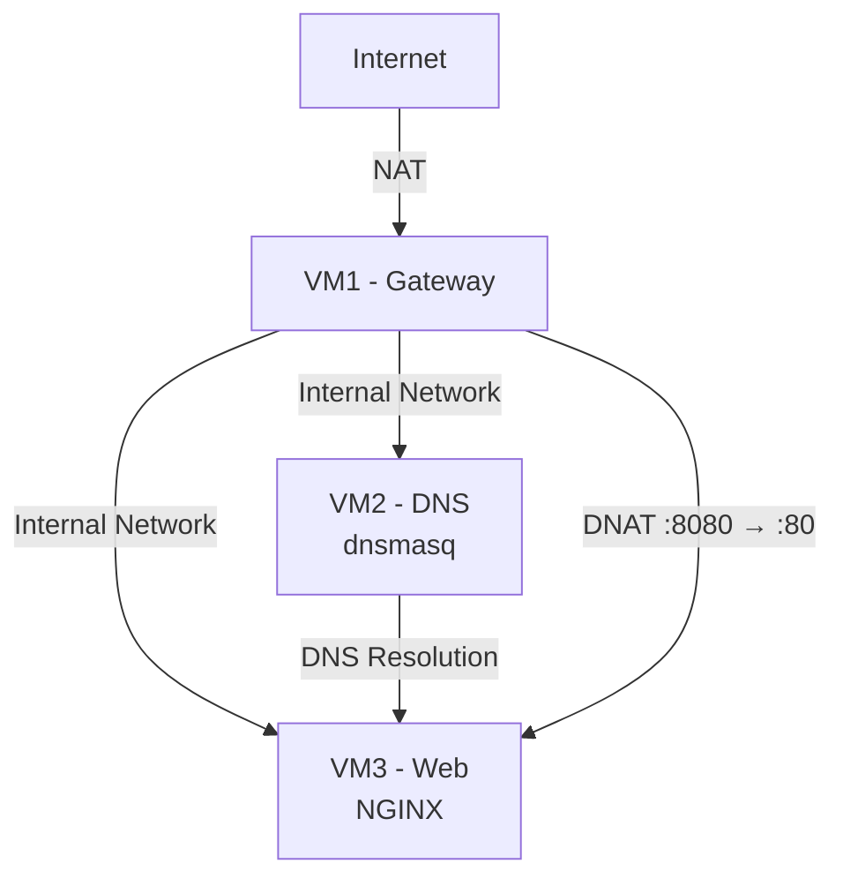
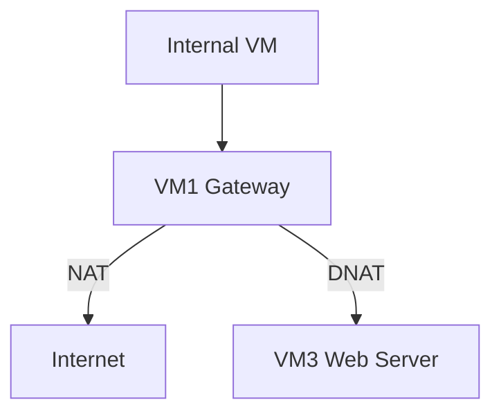
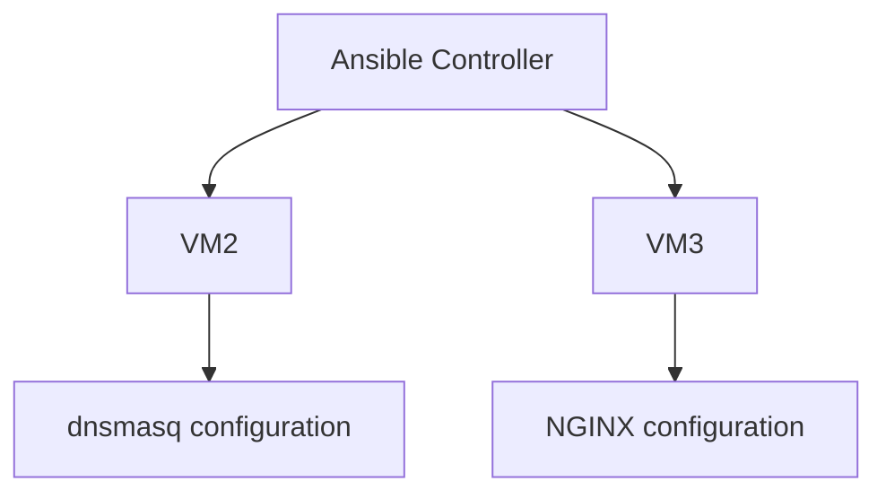
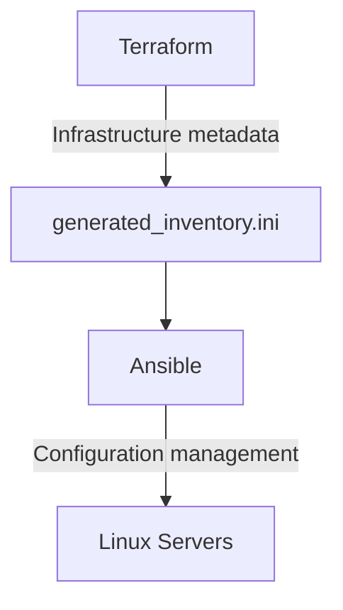
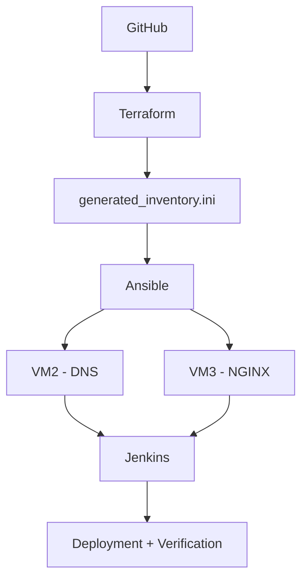
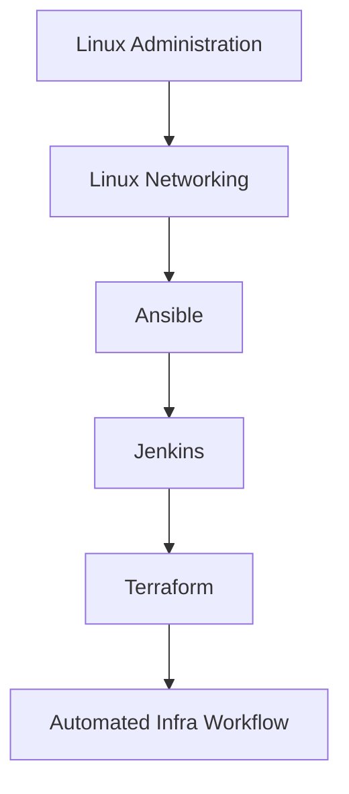

# LINUX INFRASTRUCTURE AND AUTOMATION CAPSTONE

A Hands on Infrastructure Project combining Linux, Ansible, Jenkins and Terraform to bring Linux Administration , Networking , Automation
CI (Continuous Integration) and IaC ( Infrastructure as Code) into a single environment.

The project  consists of 3 Rocky Linux Virtual Machines hosted in Virtual Box with dedicated Infrastructue roles and an Internal Network.
The environment was first built and validated maunually . It was later automated step by step using Ansible, Jenkins and Terraform 

## PROJECT OVERVIEW

The goal of this project is to build a small but realistic Linux Environment , manually configure the administration , networking and progressively automate the administration
This project covers:
+ Linux System Administration
+ TCP/IP Networking and Routing
+ Firewall  Rules and Policies
+ Internal DNS using dnsmasq
+ NGINX Web Services
+ Hardening
+ Ansible
+ CI using Jenkins
+ IaC using Terraform
+ Version Control using Git/Github

## ARCHITECTURE
The project consists of 3 Rocky Linux 9.8 VMs(Virtual Machines) connected through an internal network while one of them functions as a Gateway server supporting NAT and forwarding

## Architecture



## VM Roles

| VM  | Role | Main Services |
|-----|------|---------------|
| VM1 | Gateway    | Routing, NAT, Firewall|
| VM2 |	DNS Server | dnsmasq|
| VM3 |	Web Server | NGINX |

## Environment

### Virtualization
+ VirtualBox
+ 3 Rocky Linux 9.8 virtual machines
+ Internal network: proj-internal

### Operating System
+ Rocky Linux 9.8 (Blue Onyx)

### Network Design
+ enp0s3 → NAT → Internet access
+ enp0s8 →  Internal network
+ VM2 and VM3 connect to the internal network through their internal interfaces.

## Implementation

### 1. Linux Administration

This was initially configured manually to build a base for the machine before automating anything. This phase involved the following tasks
+ Hostname configuration
+ User configuration
+ Package management
+ Service management using systemctl
+ Process and Resource management
+ File and Service management
+ SSH Hardening ( Private Key generation)
+ Service hardening
+ Service Troubleshooting
+ Configuration persistence after rebooting machine
This also involved deliberately failing service and bringing them back up to understand them even more.

### 2. Linux Networking
VM1 was configured as the network gateway for the internal environment.

Implemented:

+ Static IP addressing
+ IP forwarding
+ Routing
+ NAT/MASQUERADE
+ DNAT
+ Stateful firewall rules
+ Internal network connectivity
+ Controlled forwarding between interfaces

The gateway uses a default FORWARD policy of DROP, with explicit rules allowing required traffic.

Example traffic flow:


### 3. DNS and Web Services

+ DNS
VM2 provides internal DNS using dnsmasq.
DNS configuration was also tested from other nodes to verify that hostname resolution worked correctly across the internal network.

+ Web Server
VM3 runs NGINX and provides the web service for the environment.
The web server was tested both directly from the internal network and through the gateway's DNAT configuration.

### 4. Ansible Configuration Management 

Once the Infrastructure was manually validated, Ansible was used to automate it entirely. It includes

+ Validation of dnsmasq service as it is base of our VM's Internal Network ( Checking of Installation , State of Service)
+ Validation of NGINX service in our Web Server ( Checking of Installation , State of Service)
+ Creation of templates to avoid hard-coding
+ Idempotent Execution (Example: If NGINX is found to be installed , it wont be installed again )



#### 5. Jenkins CI Automation

Jenkins was introduced to automate the Ansible deployment workflow.

The Jenkins job:

+ Checks out the project from GitHub
+ Executes the Ansible deployment
+ Applies configuration to the target servers
+ Performs post-deployment verification

The Jenkins service account was configured with the required SSH credentials and permissions to execute the automation.

The project also involved troubleshooting service-account-specific issues such as:

+ SSH key permissions
+ known_hosts access
+ Privilege escalation
+ Jenkins workspace permissions

### 6. Terraform / Infrastructure as Code

Terraform was introduced as a lightweight Infrastructure as Code component.

Rather than forcing Terraform to manage the VirtualBox virtual machines directly, it is used to define infrastructure metadata and generate the Ansible inventory.

Terraform variables define the environment:

Domain
DNS IP
Web IP

Terraform then generates:

generated_inventory.ini

This creates a clear separation of responsibilities:


## AUTOMATION WORKFLOW

The final workflow combines the individual technologies into a single infrastructure pipeline:


The technologies have deliberately separated responsibilities:
| Technology | Responsibility |
|---|---|
| Git/GitHub | Source control |
| Terraform | Infrastructure metadata / inventory generation |
| Ansible | Server configuration |
| Jenkins | Automation orchestration and verification |
| Linux | Operating system and services |
| VirtualBox | Lab virtualization |

## VALIDATION AND TESTING 
The environment was validated and tested at multiple levels:

### Network Validation
+ Interface and IP verification
+ Routing verification
+ Internal connectivity testing
+ NAT testing
+ DNAT testing
+ Firewall rule validation
+ DNS Validation
### Internal hostname resolution
+ dnsmasq service status
+ DNS connectivity from other nodes
+ Web Validation
+ NGINX service status
+ HTTP connectivity
+ Internal web access
+ Gateway DNAT access
### Automation Validation
+ Ansible connectivity using SSH keys
+ Ansible playbook execution
+ Idempotency testing
+ Jenkins deployment execution
+ Post-deployment verification
+ Terraform plan validation
+ Reboot Validation

Services and networking were also tested after VM reboots to ensure that configuration persisted correctly.

## KEY TROUBLESHOOTING

A significant part of the project involved diagnosing real configuration and service failures.

Examples included:

+ dnsmasq failing to start because the configured address was not yet available during boot
+ SSH authentication and private-key permission issues
+ Jenkins service-account access problems:
    + known_hosts permission
    + Ansible privilege escalation problems
    + Firewall forwarding behaviour
    + Terraform state and configuration drift
    + Service behaviour after reboot

These failures were treated as part of the learning process rather than simply working around them.

## SKILLS DEMONSTRATED
### Linux Administration
+ System administration
+ systemd
+ SSH
+ Package management
+ Permissions
+ Service troubleshooting
### Networking
+ TCP/IP
+ Routing
+ NAT
+ DNAT
+ DNS
+ DHCP concepts
+ Firewalling
+ Network troubleshooting
### Automation
+ Ansible
+ Jinja2 templates
+ Idempotent configuration
### Terraform
+ Infrastructure metadata
### CI/CD
+ Jenkins
+ Git/GitHub integration
+ Automated deployment
+ Post-deployment verification
### Web & Infrastructure Services
+ NGINX
+ dnsmasq

## PROJECT STRUCTURE
```text
linux-capstone-ansible/
│
├── README.md
│
├── dns-config.yml
├── deploy.yml
│
├── group_vars/
│   ├── dns.yml
│   └── web.yml
│
├── templates/
│   └── dnsmasq.conf.j2
│
└── terraform/
    ├── main.tf
    ├── variables.tf
    ├── outputs.tf
    ├── terraform.tfvars
    └── generated_inventory.ini
```
## OUTCOME

The project evolved from a manually configured Linux environment into an automated infrastructure workflow.
The final implementation demonstrates how individual infrastructure technologies can work together:

